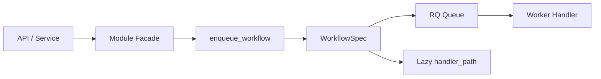

# Workflow Registry

## What WorkflowSpec Is

`WorkflowSpec` describes a queued workflow without importing the handler callable
at module-registration time.

It stores:

- `workflow_type`: stable database/API identifier.
- `queue_name`: RQ queue name.
- `handler_path`: lazy dotted handler path in `module:function` format.
- `args_mode`: default argument convention for enqueueing.
- `description`: human-readable purpose.

## Why Handler Path Is Lazy

Handlers are stored as strings to avoid import cycles between queues, modules,
routers, services, and workers. Runtime code resolves the handler only when a job
is enqueued or when a delayed retry needs the callable.

This keeps `app.modules.registry` metadata-only and avoids importing FastAPI
routers from the registry.

## Args Modes

- `JOB_ID`: default args are `(job_id,)`.
- `NONE`: default args are `()`.
- `CUSTOM`: callers must pass explicit args; omitting args raises `ValueError`.

## Current Workflows

| Workflow type | Module | Queue | Args mode | Handler path |
| --- | --- | --- | --- | --- |
| `account_update` | `account_editing` | `profile_jobs` | `JOB_ID` | `app.modules.account_editing.jobs:run_account_update_job` |
| `warmup_due_sessions` | `warmup` | `warmup_jobs` | `NONE` | `app.modules.warmup.jobs:run_warmup_due_sessions` |
| `warmup_dispatch_tick` | `warmup` | `warmup_dispatch_jobs` | `NONE` | `app.modules.warmup.jobs:run_warmup_dispatch_tick` |

## How Account Update Enqueue Works



For `/api/account-update/jobs`, the API calls
`app.modules.account_editing.service.enqueue_job()`. The facade calls
`enqueue_workflow(workflow_type="account_update", job_id=job.id)`.

The old `app.job_queue.rq.enqueue_account_update_job()` remains as a compatibility
function and delegates to the workflow registry.

## How Account Update Delayed Retry Works

`reenqueue_job_with_delay(..., workflow_type="account_update")` resolves the
`account_update` `WorkflowSpec`, uses the spec queue, resolves the lazy handler,
and preserves the retry job id format:

```text
retry-{job_id}
```

Default/profile delayed retry still uses the existing profile worker handler.

## How To Add A New Workflow

1. Add a module-owned worker wrapper when needed.
2. Add a `WorkflowSpec` to the module metadata.
3. Pick the correct `WorkflowArgsMode`.
4. Add registry tests for unique workflow types, queue name, handler path, and args mode.
5. Add enqueue tests proving the runtime path uses `enqueue_workflow()`.
6. Avoid importing routers or services from `app.modules.registry`.

## Testing Requirements

Every workflow should have tests for:

- unique `workflow_type`
- valid queue name
- lazy `handler_path` containing `:`
- resolvable handler path
- correct args mode
- enqueue behavior
- Redis failure behavior when enqueueing is part of the runtime path
