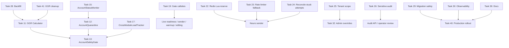

# Cross-task Dependency Graph

## High-impact Dependency Chains

| Chain | Risk |
| --- | --- |
| Task 22 Redis reserve -> Task 19 sender -> Task 40 rollout | Redis failure can fail open for live send concurrency and fail cold-call budget, weakening safety exactly during degraded infrastructure. |
| Task 11 GGR -> Task 13 gate -> Task 19 callsites | Workspace-mismatched GGR inputs can cause false allow/block decisions across all gate users. |
| Task 12 quarantine -> Task 30 observability -> Task 40 rollout | Duplicate quarantines/stale denominator/broken Grafana query can make operator rollout signals wrong. |
| Task 24 reconcile -> Task 19 sender | Sender leaves attempts stuck; reconcile can recover later, but context validation gaps can misclassify corrupt attempts. |
| Task 25 tenant scope -> Task 32 safety overrides | Override rows are account-owned but not workspace-scoped or covered by semgrep, increasing future admin-control regression risk. |
| Task 26 sensitive audit -> audit APIs/docs | Email/phone PII redaction gap affects admin mutation audit rows and any operator-visible metadata. |
| Task 28/29 migrations/backfill -> Task 40 rollout | Replay not proven, backfill has race/non-deterministic seed, and some downgrades are lossy. |
| Task 14 behavior emulator -> Task 19 live sender | Behavior foundation exists, but live sender does not use behavior-aware sequencing. |

## Quick Wins

1. Sender finalizer for all error paths.
2. Redaction regex/key expansion.
3. Grafana metric rename.
4. `prometheus_client` dependency/test skip decision.
5. Dashboard checkbox for `override_gate_block`.

## Deep Refactors

1. Account lifecycle/cascade policy for safety tables.
2. Redis degraded-mode and reservation counter redesign.
3. Workspace-scoped `AccountSafetyOverride`.
4. Status monitor batching/scheduler locking.
5. Disposable migration replay harness.
