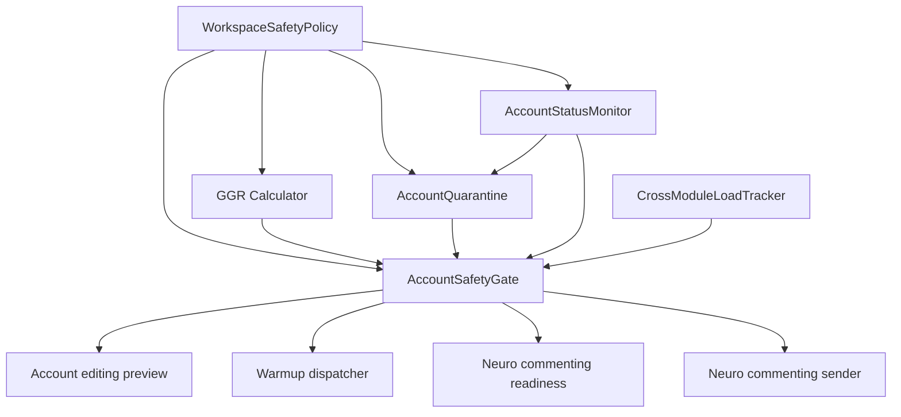

# Account Safety Pipeline

> Current status: the safety-pipeline foundation exists, but Workspace Safety Policy is temporarily neutralized by developer decision while `WORKSPACE_SAFETY_POLICY_TEMPORARILY_DISABLED=True`. Do not describe workspace-wide behavior limits, quiet hours, or auto-pauses as active until `.mex/status/current.md` is superseded. Rollout and re-enable details live in `docs/runbooks/safety-rollout.md`.

This document is a navigation and boundary guide for safety work. Verify behavior in code before editing docs.

## Source-of-truth lookup

| Question | Check first | Then check |
| --- | --- | --- |
| Is Workspace Safety Policy active? | `.mex/status/current.md`, `backend/app/config.py` | `docs/runbooks/safety-rollout.md` |
| Which module owns safety behavior? | `backend/app/modules/account_safety/` | `docs/architecture/legacy-wrappers.json` |
| Which compatibility service paths still exist? | `backend/app/services/` wrappers | `docs/architecture/legacy-wrappers.json` |
| What does the gate evaluate? | `backend/app/modules/account_safety/` interfaces/gate code | targeted tests under `backend/tests/` |
| Which live paths consume gate verdicts? | account editing, warmup, neuro-commenting callsites | `.mex/context/security.md`, `.mex/context/warmup.md` |
| Which rollout posture is current? | `.mex/status/current.md` | `docs/runbooks/safety-rollout.md` |

## Runtime boundary

The account safety pipeline is a backend foundation for reducing operator mistakes, noisy cross-module execution, and unsafe execution attempts. Current runtime behavior depends on feature flags and the temporary Workspace Safety Policy kill-switch.

While `WORKSPACE_SAFETY_POLICY_TEMPORARILY_DISABLED=True`, persisted workspace policy rows remain untouched, but consumers receive a neutral transient policy.

## Architecture Diagram



## Current Gates and Flags

- `WORKSPACE_SAFETY_POLICY_TEMPORARILY_DISABLED=True` neutralizes Workspace Safety Policy consumers; see `.mex/status/current.md`.
- `safety_pipeline_v2_enabled=false` keeps AccountSafetyGate in legacy shim mode.
- Legacy shim mode only evaluates `proxy_unhealthy`, `no_warmup`, and `active_quarantine`.
- Full rollout must follow `docs/runbooks/safety-rollout.md` and explicit operator approval.

## Safe editing rules

- Do not enable or flip safety rollout flags without an explicit operator task.
- Do not describe workspace-wide behavioral limits as active while the kill-switch is on.
- Do not store secrets, raw TDLib paths, proxy passwords, auth codes, message bodies, or raw logs in safety events or memory.
- Do not treat compatibility wrappers under `backend/app/services/` as new ownership centers.
- Do not bypass module-owned safety interfaces from feature modules.

## Callsite checks

Before changing a safety behavior, inspect affected callsites rather than trusting this document:

- account editing preview/job creation;
- warmup dispatch and session pause behavior;
- neuro-commenting readiness;
- neuro-commenting sender/live attempt paths;
- worker/runtime diagnostics when verdicts affect execution.

## Recovery Procedures

### Stuck attempts

Use the reconcile path from `backend/app/services/reconcile_stuck_attempts.py` and the operational guidance in `docs/runbooks/safety-rollout.md`. Confirm the account is still in the same workspace, inspect gate reasons, and avoid retrying live sends until the account has an `ok` or accepted `warning` verdict.

### Disaster mode

Use the workspace feature flag rollback first:

```http
PATCH /api/workspaces/{workspace_id}/feature-flags
Content-Type: application/json

{"safety_pipeline_v2_enabled": false}
```

Then keep metrics scraping on, preserve audit history, and handle quarantine/terminal status only through admin APIs. Do not bulk-delete gate, GGR, quarantine, status-observation, or event rows.

### Terminal status

Terminal status is not time-based. Operators must confirm recovery outside automation, then clear via admin route:

```http
POST /api/accounts/{account_id}/terminal-status/clear
Content-Type: application/json

{"reason": "operator verified account recovered and login state is valid"}
```

## Observability

Metrics and alerts live in `docs/runbooks/safety-alerts.md`. Grafana dashboard JSON lives at `docs/grafana/safety-pipeline.json`.

## Known Limitations

| Limitation | How to verify before changing behavior | Severity |
| --- | --- | --- |
| Workspace Safety Policy is temporarily neutralized by kill-switch. | Check `.mex/status/current.md` and `backend/app/config.py`. | high |
| GGR `history` component may be stubbed until a real history source exists. | Inspect current GGR implementation and tests before relying on history. | medium |
| Some status-monitor or quarantine edge cases may depend on current module code rather than old task notes. | Inspect `backend/app/modules/account_safety/` and relevant tests before editing. | medium |
| Bought-account rest-period and TDLib session-termination behavior may have live-runtime caveats. | Inspect onboarding/lifecycle modules and runbooks before changing live behavior. | medium |

Do not cite old task numbers as proof. Link to current code, tests, runbooks, or generated architecture artifacts instead.
