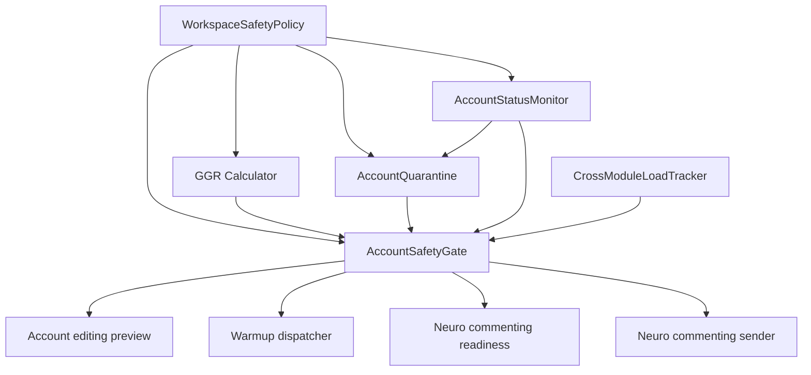

# Account Safety Pipeline

> Current status: the safety-pipeline foundation exists, but Workspace Safety Policy is temporarily neutralized by developer decision while `WORKSPACE_SAFETY_POLICY_TEMPORARILY_DISABLED=True`. Do not describe workspace-wide behavior limits, quiet hours, or auto-pauses as active until `.mex/status/current.md` is superseded. Rollout and re-enable details live in `docs/runbooks/safety-rollout.md`.

The account safety pipeline is a backend foundation for reducing operator mistakes, noisy cross-module execution, and unsafe execution attempts. It combines workspace policy, account survivability scoring, quarantine state, status monitoring, cross-module load tracking, and preflight gate checks before editing, warmup, and commenting workflows execute. Current runtime behavior depends on feature flags and the temporary Workspace Safety Policy kill-switch.

## Architecture Diagram



Sources: `backend/app/modules/account_safety/*`, compatibility wrappers under `backend/app/services/`, and API compatibility wrappers listed in `docs/architecture/legacy-wrappers.json`.

## Layer Summary

### WorkspaceSafetyPolicy

Stores per-workspace safety mode and thresholds used by behavior pacing, warmup/commenting gates, flood-wait handling, and quarantine duration. While `WORKSPACE_SAFETY_POLICY_TEMPORARILY_DISABLED=True`, consumers receive a neutral transient policy and persisted policy rows are untouched.

### GGR Calculator

Computes a 1.0-10.0 account survivability/readiness score and stores a bucketed score. Inputs include account age, origin, proxy status, latest warmup session, profile completeness, and recent status observations. The `history` component remains stubbed at 1.0 until a real history source exists.

### AccountQuarantine

Stores temporary account-level blocks with reason, expiry, release metadata, and metrics. Active quarantine always becomes gate reason `active_quarantine` with metadata `{quarantine_id, reason}`.

### AccountStatusMonitor

Records account/proxy/runtime observations, detects degraded account health, and can auto-pause risky execution. Sticky-IP and failure-threshold behavior depends on status observations and policy settings.

### CrossModuleLoadTracker

Records hourly per-account action buckets across warmup, commenting, editing, and other modules, then evaluates overload. Thresholds are tied to policy mode, but policy behavior is neutralized while the temporary kill-switch is on.

### AccountSafetyGate

Provides one preflight verdict for execution intents. It is fail-closed when cold-call budget is exceeded, cache-backed when possible, and uses a legacy shim while `safety_pipeline_v2_enabled=false`.

## Callsites

| Callsite | Intent | Behavior |
| --- | --- | --- |
| `backend/app/modules/account_editing/service.py` | `editing` | Blocks job creation on blocked verdict; surfaces warnings in preview fields. |
| `backend/app/modules/warmup/dispatcher.py` | `warmup` | Pauses warmup session as `paused_risk` when blocked. |
| `backend/app/services/neuro_commenting/live_readiness_service.py` | `commenting` | Adds readiness blockers/warnings before live commenting. |
| `backend/app/services/neuro_commenting/sender_service.py` | `commenting` | Skips send attempts blocked by gate and attempts atomic reserve for concurrency. |

## Current Gates and Flags

- `WORKSPACE_SAFETY_POLICY_TEMPORARILY_DISABLED=True` neutralizes Workspace Safety Policy consumers; see `.mex/status/current.md`.
- `safety_pipeline_v2_enabled=false` keeps AccountSafetyGate in legacy shim mode.
- Legacy shim mode only evaluates `proxy_unhealthy`, `no_warmup`, and `active_quarantine`.
- Full rollout must follow `docs/runbooks/safety-rollout.md`.

## Quarantine Reasons Matrix

| Reason code | Trigger | Default duration | Recovery procedure |
| --- | --- | --- | --- |
| `flood_wait` | Flood-wait signals after execution handling. | `WorkspaceSafetyPolicy.quarantine_hours_on_flood_wait`; preset default 24h. | Wait until `until`, then recheck proxy/status. Admin release only with reason through `/api/accounts/{account_id}/quarantine/release`. |
| `status_degraded` | AccountStatusMonitor detects more than 3 distinct proxy IP hashes in 1h. | 24h. | Fix proxy stickiness, confirm latest status observation is stable, then release with operator reason if still active. |
| `manual` | Operator-created quarantine reason. | Operator-defined. | Release/admin override with substantive reason; preserve audit. |
| `bought_rest_period` | Bought-account onboarding starts rest period. | 120h; weak GGR precheck extends it by 72h. | Let rest period finish, then run onboarding GGR precheck; passing precheck auto-releases with `bought_onboarding_ggr_passed`. |
| `fraud_high` | Contract-supported fraud-risk quarantine reason. | Caller-defined; no current writer found in source scan. | Investigate source signal, keep account out of live send paths until reason is cleared. |
| `terminal_status` | Surfaced by gate when `account.terminal_status` is terminal. | No expiry. | Use admin-only `/api/accounts/{account_id}/terminal-status/clear` after external recovery evidence. |

## Recovery Procedures

### Stuck attempts

Use the reconcile path from `backend/app/services/reconcile_stuck_attempts.py` and the operational guidance in `docs/runbooks/safety-rollout.md`. Confirm the account is still in the same workspace, inspect gate reasons, and avoid retrying live sends until the account has an `ok` or accepted `warning` verdict.

### Disaster mode

Use the workspace feature flag rollback first:

```http
PATCH /api/workspaces/{workspace_id}/feature-flags
Content-Type: application/json

{"safety_pipeline_v2_enabled": false}
```

Then keep metrics scraping on, preserve audit history, and handle quarantine/terminal status only through admin APIs. Do not bulk-delete gate, GGR, quarantine, status-observation, or event rows.

### Terminal status

Terminal status is not time-based. Operators must confirm recovery outside automation, then clear via admin route:

```http
POST /api/accounts/{account_id}/terminal-status/clear
Content-Type: application/json

{"reason": "operator verified account recovered and login state is valid"}
```

## Observability

Metrics and alerts live in `docs/runbooks/safety-alerts.md`. Grafana dashboard JSON lives at `docs/grafana/safety-pipeline.json`.

Key metrics:

| Metric | Purpose |
| --- | --- |
| `safety_gate_blocks_total` | Block volume by workspace, intent, reason. |
| `quarantine_active` | Active quarantine count by workspace and reason. |
| `ggr_score` | Score histogram by bucket. |
| `flood_wait_total` | Flood-wait spikes. |
| `attempt_send_duration_seconds` | Send latency SLO. |
| `safety_gate_evaluate_duration_seconds` | Gate latency and cache behavior. |
| `cross_module_overload_total` | Cross-module overload visibility. |

## Known Limitations

| Origin | Limitation | Severity |
| --- | --- | --- |
| Current status | Workspace Safety Policy is temporarily neutralized by kill-switch. | high |
| GGR | `history` remains stubbed at 1.0 until a real history source exists. | medium |
| Task 15 audit | `device_model_hash` change is written in `details_json`, not sensitive audit. | low |
| Task 15 audit | `fraud_score >= 0.7` branch is not implemented in AccountStatusMonitor auto-pause. | medium |
| Task 15 audit | Sticky-IP overwrite can replace a prior cooldown reason. | low |
| Task 18 audit | Rest-period quarantine starts before confirmed 2FA. | low |
| Task 18 audit | `run_terminate_other_sessions` without `tdlib_client` silently skips real TDLib call. | medium |
| Task 17 audit | Module docstring is absent; non-PostgreSQL fallback is not race-safe. | low |
