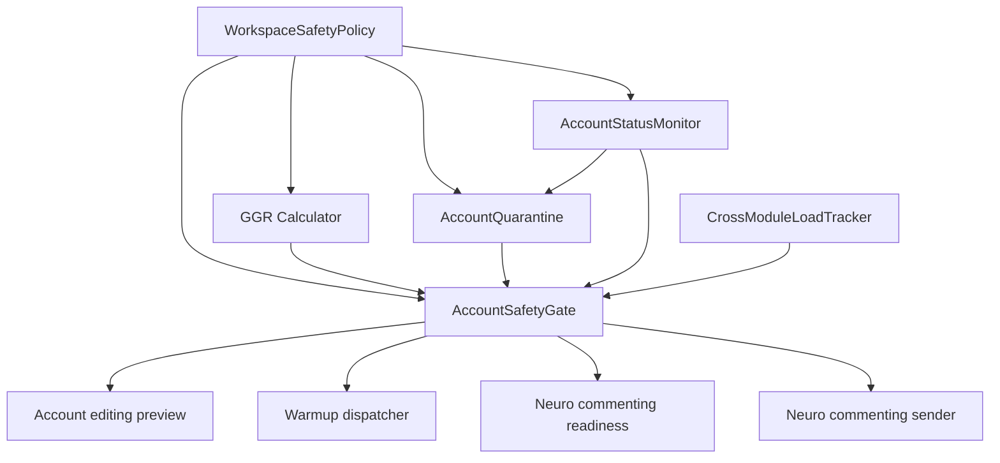

# Account Safety Pipeline

The account safety pipeline protects Telegram accounts from avoidable bans, lockouts, noisy cross-module execution, and operator mistakes. It combines workspace policy, account survivability scoring, quarantine state, status monitoring, cross-module load tracking, and preflight gate checks before editing, warmup, and commenting workflows can execute.

## Architecture Diagram



Sources: `backend/app/services/workspace_safety_policy.py`, `backend/app/services/ggr_calculator.py`, `backend/app/services/account_quarantine.py`, `backend/app/services/account_status_monitor.py`, `backend/app/services/cross_module_load_tracker.py`, and `backend/app/services/account_safety_gate.py`.

## Layer-by-Layer Breakdown

### WorkspaceSafetyPolicy

Purpose: stores per-workspace safety mode and thresholds used by behavior pacing, warmup/commenting gates, flood-wait handling, and quarantine duration.

Inputs: admin updates through `PATCH /api/workspaces/{workspace_id}/safety-policy`, preset defaults, workspace id.

Outputs: a public policy snapshot, changed-field audit data, and a policy row created on demand when missing.

Configuration:

| Field | Use |
| --- | --- |
| `mode` | `conservative`, `balanced`, or `aggressive`; also maps to cross-module load thresholds. |
| `delay_multiplier` | Human-behavior pacing multiplier. |
| `typing_chars_per_minute_min`, `typing_chars_per_minute_max` | Typing-speed bounds. |
| `profile_view_probability`, `scroll_probability`, `typo_probability`, `message_deletion_probability` | Human-like interaction probabilities. |
| `quiet_hours_local_start`, `quiet_hours_local_end` | Quiet-hour window, minutes from local midnight. |
| `require_warmup_before_commenting` | Blocks commenting until warmup exists and is complete. |
| `min_warmup_days` | Minimum completed warmup day count. |
| `require_healthy_proxy` | Requires healthy proxy for warmup/commenting in policy-gated paths. |
| `min_account_age_hours` | Blocks commenting for accounts younger than threshold. |
| `auto_pause_on_flood_wait_count` | Flood-wait count threshold in the last 24h for commenting gate. |
| `auto_pause_on_deleted_comments_count` | Reserved policy field for deleted-comment auto-pausing. |
| `quarantine_hours_on_flood_wait` | Duration for flood-wait quarantine; defaults to 24h in presets. |

Code: `backend/app/services/workspace_safety_policy.py`, `backend/app/contracts/safety_gate.py`, `backend/app/api/account_safety_policy_routes.py`.

### GGR Calculator

Purpose: computes a 1.0-10.0 GramGPT Rating for account survivability and stores a bucketed score.

Inputs: account age, account proxy status, latest warmup session, profile completeness, and currently stubbed signals for origin/history/fingerprint/IP/session anomaly.

Outputs: `account_ggr_scores.score`, `bucket`, `breakdown_json`, `last_calculated_at`, and `next_calculation_at`.

Configuration: no workspace policy knobs today; recalculates every 6 hours and smooths changes by at most 1.0 point per cycle.

Code: `backend/app/services/ggr_calculator.py`, `backend/app/api/account_ggr_routes.py`.

### AccountQuarantine

Purpose: stores temporary account-level blocks with reason, expiry, release metadata, and metrics.

Inputs: flood waits, sticky-IP/status degradation, bought-account rest period, or operator/admin actions.

Outputs: active quarantine rows read by `AccountSafetyGate`, `quarantine_active` metrics, sensitive audit on release/admin override.

Configuration: flood-wait quarantine uses `WorkspaceSafetyPolicy.quarantine_hours_on_flood_wait`; other callers pass explicit durations.

Code: `backend/app/contracts/quarantine.py`, `backend/app/services/account_quarantine.py`, `backend/app/api/account_quarantine_routes.py`.

### AccountStatusMonitor

Purpose: periodically probes persisted account/proxy/runtime state, records observations, detects degraded account health, and auto-pauses risky execution.

Inputs: `Account`, `AccountProxy`, runtime session state, optional probe error code/class, latest prior `AccountStatusObservation`.

Outputs: `account_status_observations`, `account.terminal_status`, warmup/campaign auto-pauses, `account_auto_paused` events, and `status_degraded` quarantines for sticky-IP violations.

Configuration:

| Constant | Current value | Use |
| --- | ---: | --- |
| `IP_CHANGE_COOLDOWN_MINUTES` | 30 | Gate warning window after proxy hash change. |
| `STICKY_IP_MAX_DISTINCT_HASHES` | 3 | More than 3 distinct proxy hashes in 1h opens status-degraded quarantine. |
| `CONSECUTIVE_FAILURE_THRESHOLD` | 3 | Auto-pause threshold for repeated status failures. |
| `TERMINAL_AUTH_FAILURE_THRESHOLD` | 5 | Repeated auth-class failures mark terminal status. |

Code: `backend/app/services/account_status_monitor.py`.

### CrossModuleLoadTracker

Purpose: records hourly per-account action buckets across warmup, commenting, editing, and other modules, then evaluates overload.

Inputs: module action counts through `track()`.

Outputs: `CrossModuleLoad(last_hour, last_24h, breakdown)` and `ok`, `warning`, or `blocked` verdicts.

Configuration:

| Mode | Last-hour block threshold | Last-24h block threshold |
| --- | ---: | ---: |
| `conservative` | 12 | 80 |
| `balanced` | 25 | 200 |
| `aggressive` | 60 | 500 |

Warnings start at 80% of those thresholds.

Code: `backend/app/services/cross_module_load_tracker.py`.

### AccountSafetyGate

Purpose: provides one preflight verdict for execution intents. It is fail-closed when cold-call budget is exceeded, cache-backed when possible, and uses a legacy shim while `safety_pipeline_v2_enabled` is off.

Inputs: workspace feature flag, policy, account state, GGR score, active quarantine, latest status observation, warmup state, profile completeness, flood-wait cooldowns, and cross-module load.

Outputs: `SafetyGateVerdict` with `eligible`, aggregate severity, reason list, `ggr_score`, and cache TTL.

Configuration: `CACHE_TTL_SECONDS=60`, `STALE_CACHE_TTL_SECONDS=300`, `COLD_CALL_BUDGET_PER_MINUTE=1`, plus workspace policy and feature flag.

Code: `backend/app/services/account_safety_gate.py`, `backend/app/contracts/safety_gate.py`, `backend/app/api/account_safety_routes.py`.

### Callsites

| Callsite | Intent | Behavior |
| --- | --- | --- |
| `backend/app/modules/account_editing/service.py` | `editing` | Blocks job creation on blocked verdict; surfaces warnings in preview fields. |
| `backend/app/modules/warmup/dispatcher.py` | `warmup` | Pauses warmup session as `paused_risk` when blocked. |
| `backend/app/services/neuro_commenting/live_readiness_service.py` | `commenting` | Adds readiness blockers/warnings before live commenting. |
| `backend/app/services/neuro_commenting/sender_service.py` | `commenting` | Skips send attempts blocked by gate and attempts atomic reserve for concurrency. |

## GGR Formula

The score is:

```text
score = round(1.0 + 9.0 * sum(weight[name] * component[name]), 1)
```

Current weights:

| Component | Weight | Current source |
| --- | ---: | --- |
| `age` | 0.20 | `account.created_at`; 0.0 under 1 day, 0.5 under 7 days, 0.8 under 30 days, 1.0 after 30 days. |
| `origin` | 0.10 | Stubbed at 0.7 until `account.origin` integration. |
| `history` | 0.15 | Stubbed at 1.0 until SpamBlock history exists. |
| `proxy` | 0.15 | `AccountProxy.status`; healthy `tcp_working`/`tdlib_working` => 1.0, failed => 0.0, unknown/missing => 0.5. |
| `fingerprint` | 0.10 | Stubbed at 0.5 until status-observation fingerprint integration. |
| `ip_change` | 0.10 | Stubbed at 1.0 until status-observation IP integration. |
| `session_anomaly` | 0.10 | Stubbed at 1.0 until status-observation anomaly integration. |
| `warmup` | 0.05 | Latest warmup: completed => 1.0, active/scheduled/validating => 0.5, none/other => 0.0. |
| `profile` | 0.05 | Filled first name, last name, bio, photo asset count divided by 4. |

Bucket boundaries:

| Bucket | Score |
| --- | --- |
| `strong` | `>= 7.0` |
| `medium` | `>= 4.0` and `< 7.0` |
| `weak` | `< 4.0` |

Smoothing: if a previous score exists, one calculation can move the stored score by at most 1.0 point. Recalculation interval is 6h.

## Quarantine Reasons Matrix

| Reason code | Trigger | Default duration | Recovery procedure |
| --- | --- | --- | --- |
| `flood_wait` | `handle_flood_wait()` after Telegram flood-wait signals. | `WorkspaceSafetyPolicy.quarantine_hours_on_flood_wait`; preset default 24h. | Wait until `until`, then recheck proxy/status. Admin release only with reason through `/api/accounts/{account_id}/quarantine/release`. |
| `status_degraded` | AccountStatusMonitor detects more than 3 distinct proxy IP hashes in 1h. | 24h. | Fix proxy stickiness, confirm latest status observation is stable, then release with operator reason if still active. |
| `manual` | Contract-supported manual quarantine reason for operator-created blocks. | Operator-defined. | Release/admin override with substantive reason; preserve audit. |
| `bought_rest_period` | Bought-account onboarding starts rest period. | 120h; weak GGR precheck extends it by 72h. | Let rest period finish, then run onboarding GGR precheck; passing precheck auto-releases with `bought_onboarding_ggr_passed`. Admin release only if operator accepts risk. |
| `fraud_high` | Contract-supported fraud-risk quarantine reason. | Caller-defined; no current writer found in source scan. | Investigate source signal, keep account out of live send paths until reason is cleared. |
| `terminal_status` | Not stored as `account_quarantines.reason`; surfaced by gate when `account.terminal_status` is `banned`/`deleted` or account state is terminal. | No expiry. | Use admin-only `/api/accounts/{account_id}/terminal-status/clear` after external recovery evidence. |

Active quarantine always becomes gate reason `active_quarantine` with metadata `{quarantine_id, reason}`.

## Gate Intent Checklists

Severity values below describe current gate behavior when the reason is present.

| Reason code | Editing | Warmup | Commenting | Metadata example |
| --- | --- | --- | --- | --- |
| `proxy_unhealthy` | warning | blocked when `require_healthy_proxy` | blocked when `require_healthy_proxy` | `{status: "failed"}` |
| `no_warmup` | ok | ok | blocked when warmup is required and missing | `{}` |
| `warmup_incomplete` | ok | ok | blocked when warmup is required and incomplete | `{status: "active", current_day: 2}` |
| `age_too_low` | ok | ok | blocked | `{min_account_age_hours: 24}` |
| `flood_wait_streak` | ok | ok | blocked | `{threshold: 3}` |
| `fraud_score_high` | ok | ok | blocked | `{fraud_score: 0.7}` |
| `ggr_too_low` | ok | ok | blocked when score `< 4.0` | `{}` |
| `status_degraded` | warning | warning | warning | `{consecutive_failures: 3}` |
| `profile_incomplete` | ok | ok | blocked | `{score: 0.5}` |
| `active_quarantine` | blocked | blocked | blocked | `{quarantine_id: "...", reason: "flood_wait"}` |
| `cross_module_overload` | blocked only on cold-budget fail-closed | blocked only on cold-budget fail-closed | warning or blocked by load; blocked on cold-budget fail-closed | `{last_hour: 25, last_24h: 200}` or `{budget: "cold_call"}` |
| `terminal_status` | blocked for critical/terminal states | blocked for terminal states | blocked for terminal states | `{status: "banned"}` |
| `ip_change_cooldown` | warning | warning | warning | `{observed_at: "2026-05-23T00:00:00Z"}` |

Legacy shim mode, used while `safety_pipeline_v2_enabled=false`, only evaluates `proxy_unhealthy`, `no_warmup`, and `active_quarantine`.

## Recovery Procedures

### Stuck attempts

Use the reconcile path from `backend/app/services/reconcile_stuck_attempts.py` and the operational guidance in [safety-rollout.md](../runbooks/safety-rollout.md). Confirm the account is still in the same workspace, inspect gate reasons, and avoid retrying live sends until the account has an `ok` or accepted `warning` verdict.

### Disaster mode

Use the workspace feature flag rollback first:

```http
PATCH /api/workspaces/{workspace_id}/feature-flags
Content-Type: application/json

{"safety_pipeline_v2_enabled": false}
```

Then keep metrics scraping on, preserve audit history, and handle account quarantine/terminal status only through admin APIs. Do not bulk-delete gate, GGR, quarantine, status-observation, or event rows.

### Terminal status

Terminal status is not time-based. Operators must confirm account recovery outside live TDLib automation, then clear via admin route:

```http
POST /api/accounts/{account_id}/terminal-status/clear
Content-Type: application/json

{"reason": "operator verified account recovered and login state is valid"}
```

## Feature Flag Rollout

Rollout is controlled per workspace with `safety_pipeline_v2_enabled`. Keep the default off, run the safety backfill for legacy workspaces, then follow canary -> 10% -> 50% -> 100% rollout in [safety-rollout.md](../runbooks/safety-rollout.md).

## Observability

Metrics and alerts live in [safety-alerts.md](../runbooks/safety-alerts.md). Grafana dashboard JSON lives at [safety-pipeline.json](../grafana/safety-pipeline.json).

Key metrics:

| Metric | Purpose |
| --- | --- |
| `safety_gate_blocks_total` | Block volume by workspace, intent, reason. |
| `quarantine_active` | Active quarantine count by workspace and reason. |
| `ggr_score` | Score histogram by bucket. |
| `flood_wait_total` | Flood-wait spikes. |
| `attempt_send_duration_seconds` | Send latency SLO. |
| `safety_gate_evaluate_duration_seconds` | Gate latency and cache behavior. |
| `cross_module_overload_total` | Cross-module overload visibility. |

## Known Limitations

| Origin | Limitation | Severity |
| --- | --- | --- |
| Task 15 audit | `device_model_hash` change is written in `details_json`, not sensitive audit. | low |
| Task 15 audit | `fraud_score >= 0.7` branch is not implemented in AccountStatusMonitor auto-pause. | medium |
| Task 15 audit | Sticky-IP overwrite can replace a prior cooldown reason. | low |
| Task 18 audit | Rest-period quarantine starts before confirmed 2FA. | low |
| Task 18 audit | `run_terminate_other_sessions` without `tdlib_client` silently skips real TDLib call. | medium |
| Task 17 audit | Module docstring is absent; non-PostgreSQL fallback is not race-safe. | low |

Additional current-code limitation: several GGR inputs remain stubs in `backend/app/services/ggr_calculator.py`, so the documented formula is exact, but not all formula components are fully integrated with live source tables yet.
